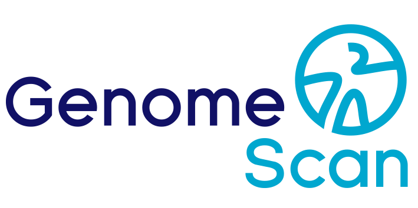

# GENOMESCAN-INTERNSHIP
This repository contains scripts, analyses, and supporting documents created
during my internship at GenomeScan.

The internship ran from November 2023 to August 2024 and focused on practical
bioinformatics development, including tool evaluation, workflow
experimentation, data analysis, and pipeline support. During this period, I
worked on Python utilities, R/Quarto analyses, shell wrappers, container
recipes, and Snakemake-related material.

A major focus of this internship project was the development, testing, and
evaluation of a classification-based approach for disease classification. In
practice, this involved working primarily with existing machine learning
classification models, combining multiple methods, and exploring whether these
approaches could be integrated into a more complete end-to-end solution. Brain
tumor data was used as the main test domain, including categories such as
astrocytoma, oligodendroglioma, glioblastoma, craniopharyngioma, ependymoma,
medulloblastoma, and glioma.

This work reflects an internship-driven and learning-oriented development
process. The main goal was to gain hands-on experience in applied
bioinformatics and real-world workflow integration.

It was a very valuable and enjoyable period in which I learned a lot,
both technically and professionally, while contributing to day-to-day
research and development activities.

```text
Copyright (C) 2025 Jasper Boom. All rights reserved.

Proprietary and confidential. Unauthorized use, copying, modification,
distribution, reverse engineering, disclosure, or creation of derivative
works is strictly prohibited without prior written permission from
Jasper Boom.
```